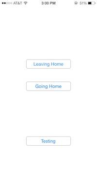
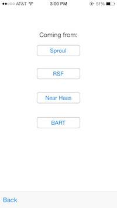

#Bus Times

A basic, no frills app that groups different bus lines together for ease of lookup.

##Screenshots
, , 

##Why bother?
As a Berkeley student who takes a lot of buses to class, the creator of this app often had to text AC Transit or look up bus times online to see when her buses were coming. However, there were often multiple bus lines and multiple bus stops that would bring her to the same place (or close enough to not matter), and it is a royal pain in the butt looking each of these stops/lines up one at a time while running to class. Not to mention it is really confusing to sort through a horrible amalgamation of badly formatted texts when texting repeatedly for updated arrival times. Thus, bus times was born.

##Can I use it?
This app is customized to the creator’s apartment and needs, so in a word, no. A customizable v2 is in the works. In the meantime, if you’re in the area and just want a quick hardcoded version to YOUR home/typical travel routes, hit me up!